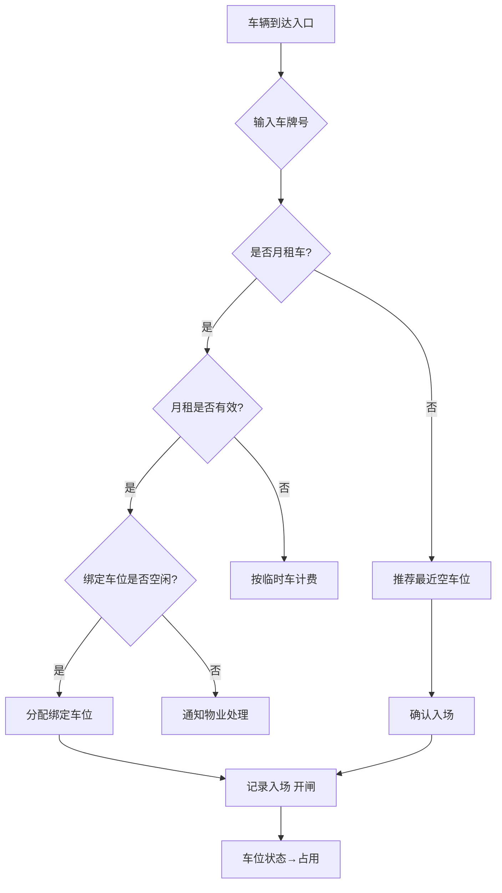
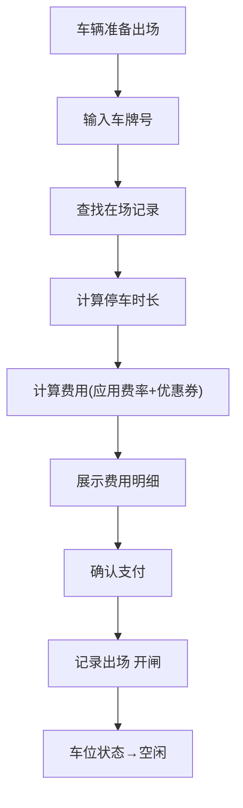

## 1. 产品概述

智慧停车场管理系统是一套面向物业运营人员的全功能停车场数字化管理平台，涵盖车位管理、车辆进出、计费结算、车位引导、月租管理及数据统计六大核心模块。目标用户为停车场管理员与物业运营人员，旨在提升停车场运营效率、降低人工成本、优化车主体验。

## 2. 核心功能

### 2.1 用户角色

| 角色 | 注册方式 | 核心权限 |
|------|----------|----------|
| 管理员 | 系统预设 | 全部功能：车位管理、车辆进出、计费规则、数据统计、月租管理 |
| 物业人员 | 管理员分配 | 车辆进出操作、月租管理、查看统计 |

### 2.2 功能模块

1. **总览仪表盘**：今日进出场次数、实时占用率饼图、收入概览、在场车辆数、异常提醒
2. **车位管理页**：停车场信息编辑、各楼层车位布局地图(CSS Grid)、车位类型/状态管理
3. **车辆进出页**：入场登记(模拟车牌识别)、出场结算、在场车辆列表
4. **计费规则页**：基础费率配置、封顶设置、车位类型费率、月租卡规则、优惠券管理
5. **车位引导页**：实时各层空余数、入场推荐车位、路线文字引导、车位预约
6. **月租管理页**：月租车CRUD、到期提醒、续费操作、月租车位被占通知
7. **数据统计页**：今日进出场、占用率实时饼图、时段趋势折线图、收入统计、平均停车时长、周转率、高峰预测

### 2.3 页面详情

| 页面名称 | 模块名称 | 功能描述 |
|----------|----------|----------|
| 总览仪表盘 | 关键指标卡片 | 今日进场/出场次数、在场车辆数、当前占用率、今日收入 |
| 总览仪表盘 | 实时占用率饼图 | 饼图展示空闲/占用/故障/预留比例 |
| 总览仪表盘 | 时段占用率趋势 | 折线图展示24小时各时段占用率 |
| 总览仪表盘 | 最近进出记录 | 最近10条进出记录列表 |
| 总览仪表盘 | 到期提醒 | 7天内到期月租车列表 |
| 车位管理 | 停车场信息 | 展示/编辑名称、地址、总车位数、楼层数 |
| 车位管理 | 楼层选择 | B1/B2/B3楼层Tab切换 |
| 车位管理 | 车位地图 | CSS Grid渲染该层40个车位，颜色区分类型与状态 |
| 车位管理 | 车位详情 | 点击车位弹出类型/状态/当前车辆信息 |
| 车位管理 | 批量操作 | 批量修改车位类型/状态 |
| 车辆进出 | 入场操作 | 输入车牌→自动推荐车位→确认入场→开闸动画 |
| 车辆进出 | 出场操作 | 输入车牌→计算时长→计算费用→优惠券→支付确认→开闸 |
| 车辆进出 | 在场车辆列表 | 表格展示车牌/入场时间/所在车位/已停时长，支持搜索 |
| 计费规则 | 基础费率 | 前30分钟免费，之后每小时5元，不足1小时按1小时计 |
| 计费规则 | 封顶设置 | 24小时封顶50元 |
| 计费规则 | 类型费率 | 新能源充电位加收充电费，不同类型不同费率倍率 |
| 计费规则 | 月租卡规则 | VIP月租固定月费，不限时 |
| 计费规则 | 优惠券管理 | 新增/编辑满减券和折扣券 |
| 车位引导 | 实时空位概览 | 各层空余数量柱状显示 |
| 车位引导 | 推荐车位 | 入场时自动推荐最近空位(低楼层优先/距入口近优先) |
| 车位引导 | 路线引导 | 文字描述:请前往B2层C区第15号车位 |
| 车位引导 | 车位预约 | 提前30分钟锁定车位，倒计时显示 |
| 月租管理 | 月租车列表 | 车牌/车主/联系方式/到期日期/绑定车位 |
| 月租管理 | 到期提醒 | 到期前7天高亮标记提醒 |
| 月租管理 | 续费操作 | 一键续费，更新到期日期 |
| 月租管理 | 占用通知 | 月租车位被临时占时通知物业 |
| 数据统计 | 进出统计 | 今日进场/出场次数对比 |
| 数据统计 | 占用率分析 | 实时饼图+时段折线图 |
| 数据统计 | 收入统计 | 日/周/月收入切换，柱状图展示 |
| 数据统计 | 平均停车时长 | 计算并展示平均停车时长 |
| 数据统计 | 周转率 | 日进出次数/总车位数 |
| 数据统计 | 高峰预测 | 基于历史数据预测高峰时段 |

## 3. 核心流程

### 3.1 车辆入场流程

管理员在车辆进出页面输入车牌号，系统查询是否为月租车(月租车自动识别免计时)，非月租车则根据空余车位自动推荐最近空车位(按楼层从低到高、距入口由近到远)，管理员确认后系统记录入场时间、分配车位、播放开闸动画，车位状态变为"占用"。

### 3.2 车辆出场流程

管理员输入车牌号，系统查找在场记录，计算停车时长和费用(应用费率规则和优惠券)，展示费用明细供确认，确认支付后记录出场时间、释放车位、播放开闸动画，车位状态变为"空闲"。

### 3.3 月租车入场流程

月租车入场时自动识别，系统检查月租是否有效(未到期)，有效则直接放行并分配其绑定车位(若未被占用)，若绑定车位被临时占用则通知物业处理。

## 4. 用户界面设计

### 4.1 设计风格

- **主色调**：深蓝灰(#1a1d2e)为底色，翡翠绿(#10b981)为功能色(空闲/成功)，琥珀黄(#f59e0b)为警告色(预留/到期)，珊瑚红(#ef4444)为危险色(占用/故障)
- **按钮风格**：圆角8px，主按钮实心填充，次按钮描边，带hover微动画
- **字体**：标题使用 Outfit(几何感科技字体)，正文使用 Noto Sans SC(中文友好)
- **布局风格**：左侧固定导航栏 + 右侧内容区，卡片式模块布局
- **图标**：Lucide React图标库，线性风格统一

### 4.2 页面设计概览

| 页面名称 | 模块名称 | UI元素 |
|----------|----------|--------|
| 总览仪表盘 | 指标卡片 | 4列Grid，每张卡片深色背景+图标+大数字+趋势箭头 |
| 总览仪表盘 | 占用率饼图 | 居中饼图，右侧图例，空心环形设计 |
| 总览仪表盘 | 趋势折线图 | 全宽折线图，面积填充渐变 |
| 车位管理 | 车位地图 | CSS Grid 8x5布局，每个格子圆角方块，颜色映射状态 |
| 车辆进出 | 入场表单 | 居中卡片表单，输入框+推荐车位卡片+确认按钮 |
| 车辆进出 | 在场列表 | 全宽表格，斑马纹行，时长实时刷新 |
| 计费规则 | 费率卡片 | 多列卡片，每类费率一张卡片展示 |
| 车位引导 | 楼层概览 | 横向3列楼层卡片，大字空余数+进度条 |
| 月租管理 | 月租列表 | 表格+到期高亮+续费弹窗 |
| 数据统计 | 图表区域 | 饼图+折线图+柱状图组合 |

### 4.3 响应式设计

桌面优先设计，导航栏在窄屏折叠为汉堡菜单，车位地图在小屏缩放适配，表格在窄屏横向滚动。

### 4.4 动效设计

- 页面切换：淡入+微上滑
- 车位状态变更：颜色渐变过渡
- 开闸动画：栅栏升起SVG动画
- 数字变化：计数器滚动效果
- 卡片悬停：微浮起+阴影增强
