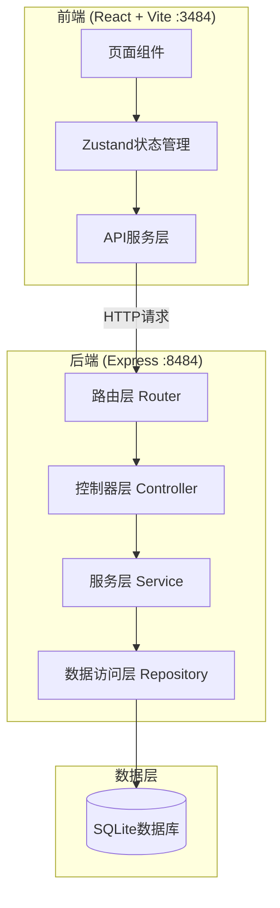
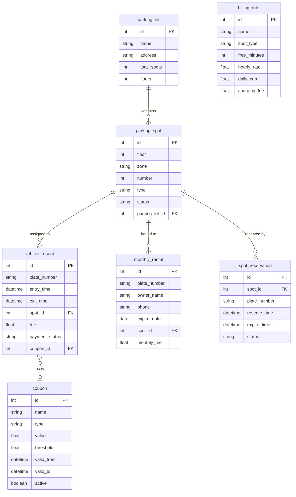

## 1. 架构设计



## 2. 技术说明

- **前端**：React@18 + TypeScript + TailwindCSS@3 + Vite + Zustand + Recharts(图表)
- **初始化工具**：vite-init (react-express-ts 模板)
- **后端**：Express@4 + TypeScript (ESM)
- **数据库**：SQLite (better-sqlite3)
- **图标**：lucide-react
- **端口**：前端3484，后端8484

## 3. 路由定义

| 路由 | 用途 |
|------|------|
| / | 总览仪表盘 |
| /parking-spots | 车位管理 |
| /vehicle-entry | 车辆进出 |
| /billing-rules | 计费规则 |
| /guidance | 车位引导 |
| /monthly-rental | 月租管理 |
| /statistics | 数据统计 |

## 4. API定义

### 4.1 停车场信息

| 方法 | 路径 | 说明 |
|------|------|------|
| GET | /api/parking-lot | 获取停车场信息 |
| PUT | /api/parking-lot | 更新停车场信息 |

### 4.2 车位管理

| 方法 | 路径 | 说明 |
|------|------|------|
| GET | /api/spots | 获取所有车位(支持楼层筛选) |
| GET | /api/spots/:id | 获取单个车位详情 |
| PUT | /api/spots/:id | 更新车位类型/状态 |
| PUT | /api/spots/batch | 批量更新车位 |

### 4.3 车辆进出

| 方法 | 路径 | 说明 |
|------|------|------|
| POST | /api/vehicles/entry | 车辆入场 |
| POST | /api/vehicles/exit | 车辆出场 |
| GET | /api/vehicles/present | 在场车辆列表 |
| GET | /api/vehicles/records | 进出记录 |

### 4.4 计费规则

| 方法 | 路径 | 说明 |
|------|------|------|
| GET | /api/billing/rules | 获取所有计费规则 |
| PUT | /api/billing/rules/:id | 更新计费规则 |
| POST | /api/billing/calculate | 计算停车费用 |
| GET | /api/coupons | 获取优惠券列表 |
| POST | /api/coupons | 创建优惠券 |
| PUT | /api/coupons/:id | 更新优惠券 |
| DELETE | /api/coupons/:id | 删除优惠券 |

### 4.5 车位引导

| 方法 | 路径 | 说明 |
|------|------|------|
| GET | /api/guidance/recommend | 推荐空车位 |
| GET | /api/guidance/floor-status | 各楼层空余数 |
| POST | /api/guidance/reserve | 预约车位 |
| DELETE | /api/guidance/reserve/:id | 取消预约 |

### 4.6 月租管理

| 方法 | 路径 | 说明 |
|------|------|------|
| GET | /api/monthly | 月租车列表 |
| POST | /api/monthly | 新增月租车 |
| PUT | /api/monthly/:id | 更新月租车 |
| DELETE | /api/monthly/:id | 删除月租车 |
| POST | /api/monthly/:id/renew | 续费 |
| GET | /api/monthly/expiring | 即将到期列表 |

### 4.7 数据统计

| 方法 | 路径 | 说明 |
|------|------|------|
| GET | /api/stats/overview | 今日概览 |
| GET | /api/stats/occupancy | 占用率数据(实时+时段) |
| GET | /api/stats/revenue | 收入统计(日/周/月) |
| GET | /api/stats/turnover | 周转率与平均时长 |
| GET | /api/stats/peak-prediction | 高峰预测 |

## 5. 服务器架构图


## 6. 数据模型

### 6.1 数据模型定义



### 6.2 数据定义语言

```sql
CREATE TABLE parking_lot (
    id INTEGER PRIMARY KEY AUTOINCREMENT,
    name TEXT NOT NULL DEFAULT '智慧停车场',
    address TEXT NOT NULL DEFAULT '',
    total_spots INTEGER NOT NULL DEFAULT 120,
    floors INTEGER NOT NULL DEFAULT 3
);

CREATE TABLE parking_spot (
    id INTEGER PRIMARY KEY AUTOINCREMENT,
    floor INTEGER NOT NULL,
    zone TEXT NOT NULL,
    number INTEGER NOT NULL,
    type TEXT NOT NULL DEFAULT 'small',
    status TEXT NOT NULL DEFAULT 'free',
    parking_lot_id INTEGER NOT NULL DEFAULT 1,
    UNIQUE(floor, zone, number)
);

CREATE TABLE vehicle_record (
    id INTEGER PRIMARY KEY AUTOINCREMENT,
    plate_number TEXT NOT NULL,
    entry_time TEXT NOT NULL,
    exit_time TEXT,
    spot_id INTEGER,
    fee REAL DEFAULT 0,
    payment_status TEXT DEFAULT 'unpaid',
    coupon_id INTEGER
);

CREATE TABLE monthly_rental (
    id INTEGER PRIMARY KEY AUTOINCREMENT,
    plate_number TEXT NOT NULL UNIQUE,
    owner_name TEXT NOT NULL,
    phone TEXT NOT NULL,
    expire_date TEXT NOT NULL,
    spot_id INTEGER NOT NULL UNIQUE,
    monthly_fee REAL DEFAULT 300
);

CREATE TABLE billing_rule (
    id INTEGER PRIMARY KEY AUTOINCREMENT,
    name TEXT NOT NULL,
    spot_type TEXT NOT NULL DEFAULT 'small',
    free_minutes INTEGER DEFAULT 30,
    hourly_rate REAL DEFAULT 5,
    daily_cap REAL DEFAULT 50,
    charging_fee REAL DEFAULT 0
);

CREATE TABLE coupon (
    id INTEGER PRIMARY KEY AUTOINCREMENT,
    name TEXT NOT NULL,
    type TEXT NOT NULL DEFAULT 'discount',
    value REAL NOT NULL,
    threshold REAL DEFAULT 0,
    valid_from TEXT NOT NULL,
    valid_to TEXT NOT NULL,
    active INTEGER DEFAULT 1
);

CREATE TABLE spot_reservation (
    id INTEGER PRIMARY KEY AUTOINCREMENT,
    spot_id INTEGER NOT NULL,
    plate_number TEXT NOT NULL,
    reserve_time TEXT NOT NULL,
    expire_time TEXT NOT NULL,
    status TEXT DEFAULT 'active'
);

-- 预置数据
INSERT INTO parking_lot (name, address, total_spots, floors) VALUES ('智慧停车场', '科技园区A栋地下', 120, 3);

-- 每层40个车位(B1/B2/B3, 每层5个区A-E每区8个)
-- 车位类型分布: small=24, large=6, ev=4, accessible=2, vip=4 (每层)
-- 预置5个占用、2个故障、3个预留状态

-- 计费规则
INSERT INTO billing_rule (name, spot_type, free_minutes, hourly_rate, daily_cap, charging_fee) VALUES ('小型车位', 'small', 30, 5, 50, 0);
INSERT INTO billing_rule (name, spot_type, free_minutes, hourly_rate, daily_cap, charging_fee) VALUES ('大型车位', 'large', 30, 8, 80, 0);
INSERT INTO billing_rule (name, spot_type, free_minutes, hourly_rate, daily_cap, charging_fee) VALUES ('新能源充电位', 'ev', 30, 5, 50, 10);
INSERT INTO billing_rule (name, spot_type, free_minutes, hourly_rate, daily_cap, charging_fee) VALUES ('无障碍车位', 'accessible', 30, 5, 50, 0);
INSERT INTO billing_rule (name, spot_type, free_minutes, hourly_rate, daily_cap, charging_fee) VALUES ('VIP月租车位', 'vip', 0, 0, 0, 0);
```
